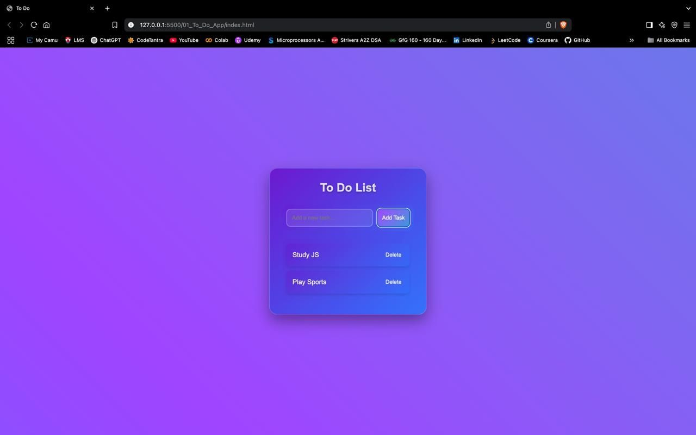
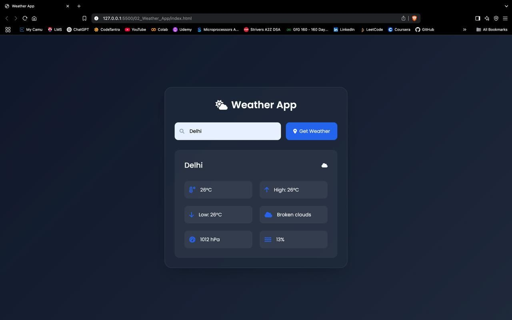
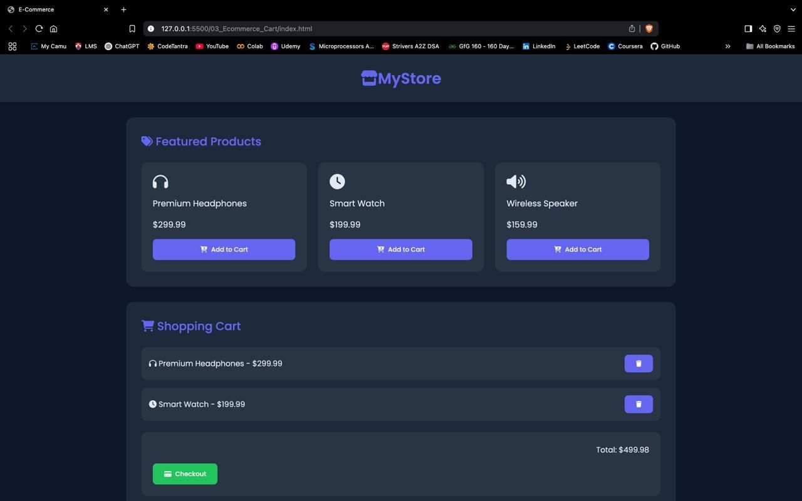
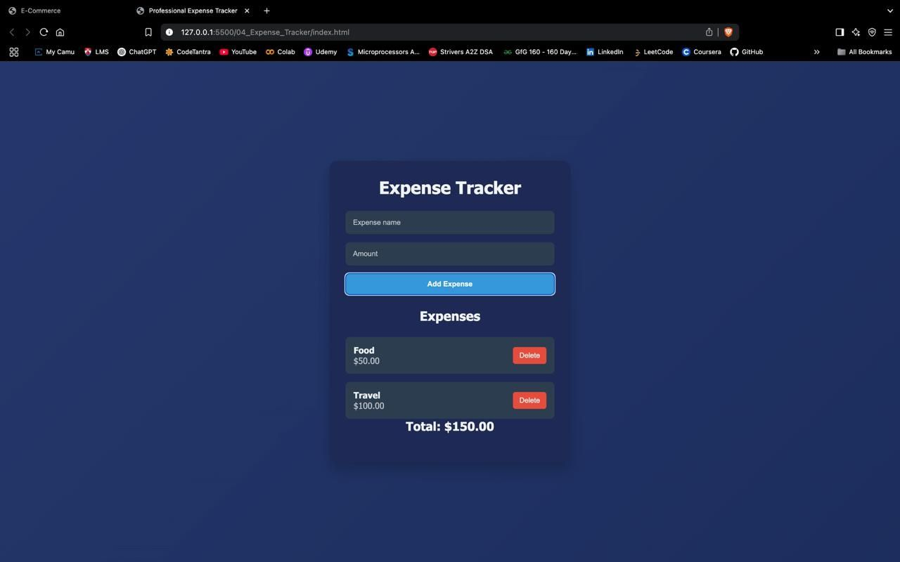
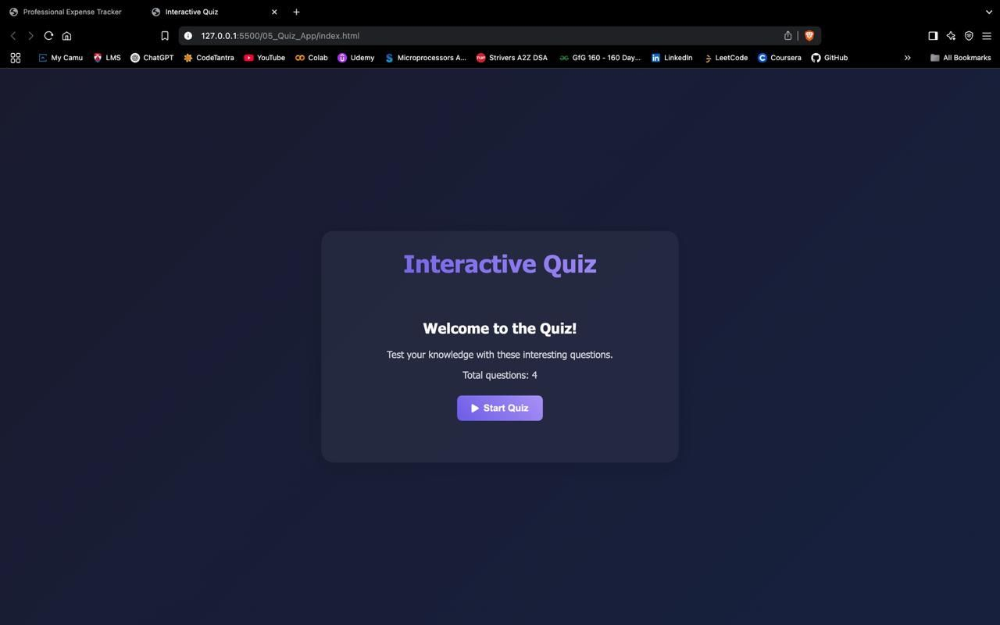
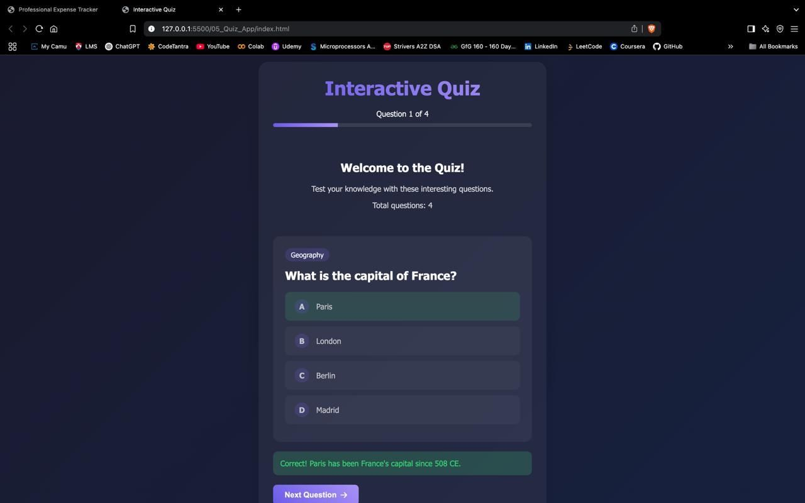
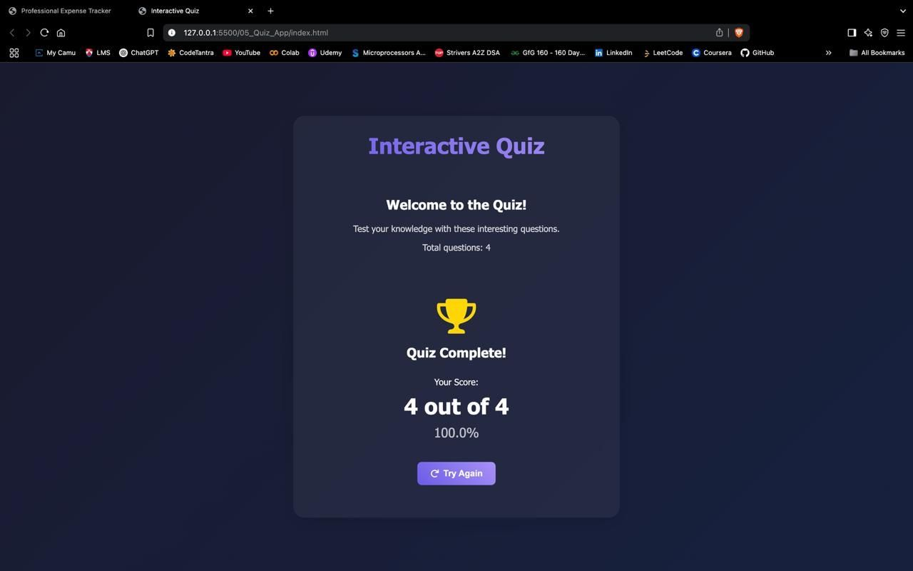

# 🧩 JavaScript Projects Collection

A curated collection of beginner-friendly JavaScript projects designed to sharpen your frontend development fundamentals. These mini-apps help you master core concepts like DOM manipulation, event handling, API integration, and local storage — all with clean, responsive UIs.

Perfect for 🎓 beginners, 💼 portfolio builders, or anyone revisiting JavaScript basics through hands-on learning.

---

## 🛠️ Tech Stack

- 🧠 **JavaScript (ES6+)** – Core logic and interactivity  
- 🧾 **HTML5 & CSS3** – Markup and styling  
- 🌐 **Fetch API** – For external API integration  
- 💾 **Local Storage** – Client-side data persistence  
- 📱 **Responsive Design** – Mobile-first approach

---

## 📂 Projects Overview

### ✅ To-Do App 🗒️  
A classic task manager with full CRUD operations.

- ➕ Add, ✏️ edit, 🗑️ delete, and ✅ mark tasks as complete  
- 💾 Tasks persist via `localStorage`  
- 🧼 Minimalistic UI for focus



---

### 🌦️ Weather App  
Fetches real-time weather using OpenWeatherMap API.

- 🔍 Search by city  
- 🌡️ Displays temperature, 💧 humidity, and conditions  
- 🚫 Handles invalid city errors



---
### 🛒 Shopping Cart  
Mock e-commerce cart functionality.

- 🧺 Add/remove items dynamically  
- 💰 Calculate total cost instantly  
- 🔄 Realtime cart updates in UI



---

### 💸 Expense Tracker  
A personal finance tracker for budgeting.

- ➕ Add income and expense entries  
- 📊 Displays current balance and transaction history  
- ♻️ Dynamic DOM updates with stored data



---

### ❓ Quiz App  
Interactive quiz game with scoring system.

- 🧠 Multiple-choice questions  
- ✅ Shows feedback for correct/incorrect answers  
- 🏆 Tracks and displays score





---

## 📘 Key Concepts Practiced

- 🧩 DOM manipulation & event listeners  
- 🔁 Looping & array methods  
- 🗃️ State management without frameworks  
- 💾 LocalStorage handling  
- 📡 API integration with `fetch`  
- 🎨 Responsive layout and clean CSS design

---

## 🚀 How to Use

1. **Clone the repository**  
   ```bash
   git clone https://github.com/Dhruv-201004/JS-Projects.git


2. **Navigate into the project folder**

   ```bash
   cd JS-Projects
   ```

3. **Open any project’s `index.html` in your browser**
   No build tools required.

---

👨‍💻 Built with 💙 by [Dhruv](https://github.com/Dhruv-201004)


